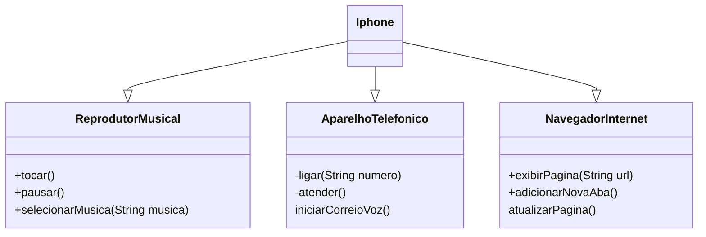

<h1 align="center">
 Desafio Iphone DIO
</h1>

## Objetivo proposto 

### Modelagem e Diagramação de um Componente iPhone

Neste desafio, você será responsável por modelar e diagramar a representação UML do componente iPhone, abrangendo suas funcionalidades como Reprodutor Musical, Aparelho Telefônico e Navegador na Internet.

## 📍 Instruções 
##### Comportamentos esperados:
* Repodutor Musicial: tocar, pausar, selecionarMusica
* Aparelho Telefônico: ligar, atender, iniciarCorrerioVoz
* Navegador na Internet: exibirPagina, adicionarNovaAba, atualizarPagina

## Diagrama UML

O diagrama UML foi criado utilizando a sintaxe [Mermaid](https://mermaid.js.org/), uma alternativa open-source e que é compatível com arquivos Markdown.

##  🔧 Tecnologias

## ✅ Contato

 
